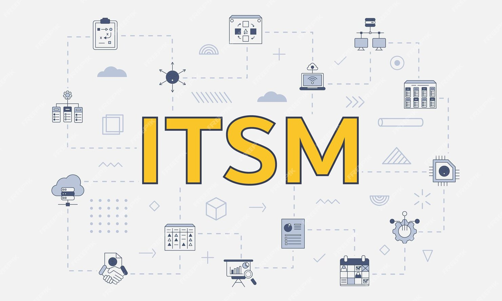

<b>Rodrigo Cardoso de Oliveira</b>
 
<b>About Me</b> 
I'm an IT professional with over than 20 years of experience in Information Technology, acting in services companies,telecom operators, and financial service. Specialized in IT service management, governance, cybersecurity, and team management with emphasis in cocreation value, and mensurable delivery results. My carrer is marked to inovators solutions implementations, and customer centricity acting in high complexity environments.
<b>Main achievements</b>
<h3><b>Restructured service delivery at Bradesco bank.</b></h3>
<b>Period:</b> 08/2023 - 11/2024 
<b>Role:</b> <i>Service Delivery Manager at Security Ecosystem Knowledge (SEK)</i> 
**Results:** 
* Enhance the CSAT indicator redefining the backlog prioritization the activites which delivery value to the customer. 
* Decrased the backlog activities by 20% estableshing the WIP control and taking control of the non-planned activities. 
*  Created the exception control (in the hardening context) to provide visibility to the customer regarding the request details, including who requested it, justification, date, impacted assets, SEK's technical evaluation, and SEK's recommendation. Additionally, established the approval workflow.

###Implemented the governance in the support area at BASF.
**Period:** 03/2023 - 08/2023 
**Role:** *Infrastructure Manager at Tech Mahindra.* 
**Results:** 
* Reduced backlog by 30% through WIP mapping and reprioritization of activities, aligning efforts with customer needs and value creation.
* Established an activity management process using a Kanban board to monitor and control all activities, identifying and addressing constraints caused by unplanned tasks and changes.
* Enhanced supplier relationships and fostered strategic partnerships, improving service quality and operational efficiency.
* Implemented a knowledge base, documenting previously undocumented processes, and established guidelines for its use and maintenance to foster knowledge sharing and continuity.

### Governance Implementation & Service Optimization at Comviva.
**Period:** 03/2018 - 02/2023 
**Role:** *Infrastructure Manager Latin America at Comviva.* 
**Results:** 
* Defined and monitored KPIs and SLAs, ensuring operational excellence and alignment with partners and clients.
* Restructured support processes, adopting the Incident Command System (ICS) as a framework, leading to improved Mean Time to Respond (MTTR) and Mean Time to Resolution (MTTR) indicators.
* Led a cost optimization project, achieving $10K monthly OPEX savings by migrating on-premises solutions to the cloud, enabling greater scalability and budget control based on demand.
* Planned and controlled CAPEX and OPEX, developing the AOP aligned with the company's strategic goals.
* Supported sales and pre-sales teams in responding to RFPs, defining SOWs, and estimating effort.
* Developed teams through Individual Development Plans (IDPs), 360° feedback, and coaching, fostering a high-performance environment.

